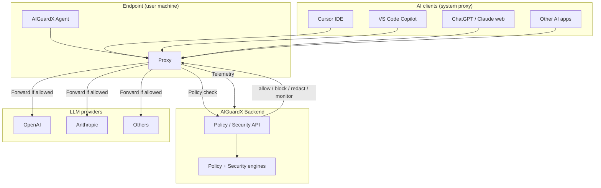
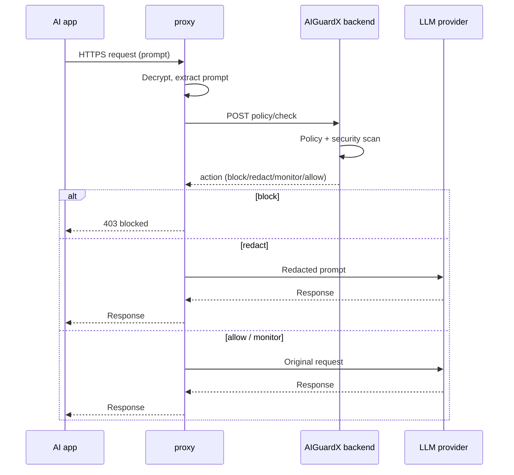
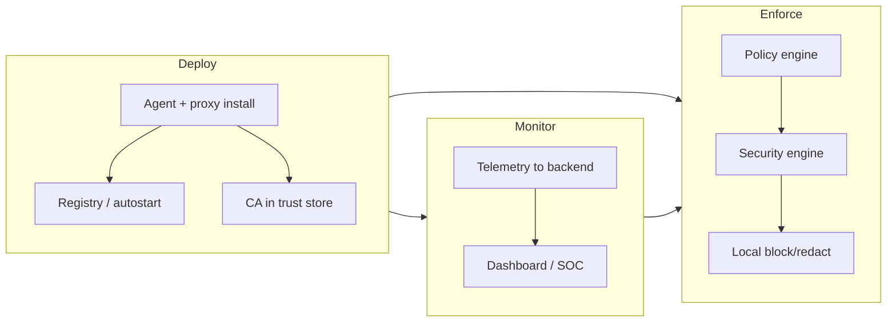

# 🛡️ _AIGuardX - Endpoint AI Security & Governance_

### _Loss Prevention for ChatGPT, Gemini, Cursor & More — Local Data Redaction and Comprehensive Forensics for the Modern Enterprise_

_[AIGuardX](https://aisecshield.zeroshield.ai), a core module of <a href="https://zeroshield.ai">ZeroShield</a>_

### Tech Stack

_intercept-orange?style=flat-square)

## 🚀 [Explore ZeroShield Solutions](https://zeroshield.ai)

## Table of Contents
* [About AIGuardX](#about-aiguardx)
* [System Architecture](#system-architecture)
  * [Architecture diagrams](#architecture-diagrams)
* [Core Modules](#core-modules)
  * [1. Endpoint Health & Telemetry](#1-endpoint-health--telemetry)
  * [2. Enhanced Policy Management](#2-enhanced-policy-management)
  * [3. Security Layer Scanning](#3-security-layer-scanning)
  * [4. Attack Detection (POC)](#4-attack-detection-demo-poc)
  * [5. Investigation & Forensics](#5-investigation--forensics)
* [Endpoint Agent & Deployment](#endpoint-agent--deployment)
* [Risk Scoring Methodology](#risk-scoring-methodology)
* [Governance & Compliance](#governance--compliance)
* [Target Users & Real-World Scenarios](#target-users--real-world-scenarios)
* [Use Cases](#use-cases)
* [Complete Product Video](#complete-product-video)
* [Support](#support)

---

## About AIGuardX

[**AIGuardX**](https://aisecshield.zeroshield.ai) is an advanced endpoint security solution within the ZeroShield ecosystem. It provides **loss prevention** for generative AI tools—including **ChatGPT**, **Gemini**, **Cursor**, **Claude**, **GitHub Copilot**, and similar applications—by deploying lightweight agents and a local proxy directly on user machines. AIGuardX is not a real-time AI guardrail layer; it focuses on **preventing data loss and policy violations** before prompts and responses leave the endpoint.

Unlike traditional cloud-based proxies, [AIGuardX](https://aisecshield.zeroshield.ai) intercepts AI-bound traffic at the source. This enables **zero-latency redaction** and **local blocking**, so sensitive PII, API keys, or proprietary code never leave the workstation. The agent supports corporate proxy environments, file-based logging, and reliable autostart via the Windows Registry Run key for consistent behavior after reboot and Fast Startup.

---

## System Architecture

[AIGuardX](https://aisecshield.zeroshield.ai) follows a **Deploy → Monitor → Enforce** lifecycle, connecting centralized governance with distributed endpoint execution.

1. **Agent Deployment**: Lightweight agents and a local proxy are installed on user machines to intercept AI traffic (ChatGPT, Claude, Cursor, Copilots, etc.).
2. **Local Enforcement**: The agent pulls real-time policies from the [AIGuardX](https://aisecshield.zeroshield.ai) platform. Blocking and redaction run locally for zero-latency security.
3. **Telemetry Stream**: Interaction metadata and security events are sent to the central dashboard for forensics and compliance reporting.

### Architecture diagrams

> View in a Markdown renderer that supports Mermaid (e.g. GitHub, VS Code preview) to see the diagrams.

**High-level: endpoint, proxy, backend, and LLM providers**

**Request flow: policy check and enforcement**

**Deploy → Monitor → Enforce lifecycle**

---

## Core Modules

### 1. Endpoint Health & Telemetry
Real-time visibility into the security posture of every machine in your fleet.
* **Live Monitoring**: CPU/memory usage and "Last Seen" status so agents are confirmed active.
* **Service Detection**: Identifies active AI services (GitHub Copilot, Cursor, ChatGPT, etc.).
* **Derivation Logic**: Status (Healthy / Warning / Critical) is derived from heartbeat age and resource use.

https://github.com/user-attachments/assets/8ad6383a-4035-4a54-bc95-29299e85fe20

### 2. Enhanced Policy Management
Central definition of security guardrails.
* **Granular Rules**: Regex, keyword, and pattern matching.
* **Action Types**:
    * **Block**: Stops the request when a violation is detected.
    * **Redact**: Sanitizes the prompt (e.g. PII) before sending to the LLM.
    * **Monitor**: Logs the event for SOC review without blocking the user.
* **Test Console**: Dry-run environment to validate policies against sample prompts before deployment.

https://github.com/user-attachments/assets/bb8952cd-180d-40be-bf85-257ba8f9d901

### 3. Security Layer Scanning
Deep inspection across multiple security dimensions:
* **Identity Layer**: User and application context for each AI request.
* **Content Layer**: Malicious payloads, prompt injection, and jailbreak attempts.
* **Data Layer**: DLP-style scanning for PII, financial data, and proprietary code.
* **Compliance Layer**: Mapping to regulatory frameworks (GDPR, SOC2, HIPAA).

### 4. Attack Detection Demo (POC)
Interactive validation against the **OWASP Top 10 for LLMs**.
* **Threat Catalog**: Prompt Injection (LLM01), Sensitive Data Leakage (LLM06), Jailbreaking (LLM04), and related scenarios.
* **Risk Score Engine**: Weighted calculation from telemetry:
    $$Risk = (Prompt \times 0.4) + (Sensitivity \times 0.35) + (Autonomy \times 0.25)$$

https://github.com/user-attachments/assets/d39cd2c7-d845-40ed-8b74-863d09235f1f

### 5. Investigation & Forensics
Every blocked or redacted event produces a detailed log for forensic analysis:
* **Live Metadata**: User identity, timestamp, and application context.
* **Raw Payload**: Full JSON of the intercepted request.
* **Security Trace**: Step-by-step list of which guardrails (DLP, injection shield, etc.) triggered enforcement.

https://github.com/user-attachments/assets/a5adcbde-6d0a-4162-9a33-ff672a28580c

---

## Endpoint Agent & Deployment

[AIGuardX](https://aisecshield.zeroshield.ai) deploys an endpoint agent and a local proxy on Windows (and supports macOS/Linux patterns):

* **Single installer**: One executable installs the agent and proxy, configures the system proxy, and installs the proxy CA into the trust store.
* **Autostart**: Uses the Windows Registry Run key (not only Task Scheduler) so the agent and proxy start reliably after login, including with Fast Startup enabled. A configurable delay (e.g. 60s) ensures the network and proxy are ready before starting.
* **Corporate proxy**: Backend registration and telemetry work through corporate proxies; original proxy settings are preserved and restored on uninstall.
* **Logging**: File-based logs (e.g. `~/.aiguardx/agent.log`, proxy logs) support troubleshooting on headless or locked-down machines.

---

## Risk Scoring Methodology

The platform computes an overall risk score (0–100) from threat detections (OWASP LLM/MCP/Agentic, PII, and optional ML guard). Score bands and recommended actions are defined as follows (aligned with the backend `RiskScorer`):

| Score range | Risk level | UI indicator | Recommended action |
| :--- | :--- | :--- | :--- |
| **85 – 100** | Critical | 🔴 Red | Block immediately; alert SOC. PII + score ≥75 also triggers block. |
| **70 – 84** | High | 🟠 Orange | Block and alert. Agentic AI threats force this action. |
| **50 – 69** | Medium | 🟡 Amber | Warn and log for investigation. |
| **25 – 49** | Low | 🟢 Green | Monitor only. |
| **0 – 24** | None | ⚪ Clear | Allow. |

Contributing factors (OWASP LLM/MCP/Agentic, PII severity, LLM-Guard/Bedrock signals) are weighted and capped at 100; the highest band reached determines the level and action.

---

## Governance & Compliance

[AIGuardX](https://aisecshield.zeroshield.ai) supports governance and compliance by:

* Enforcing policy at the endpoint before data leaves the device.
* Providing an auditable trail of AI interactions and enforcement events.
* Aligning controls with OWASP LLM guidelines and common regulatory requirements.

---

## Target Users & Real-World Scenarios

AIGuardX is built for organizations that need **loss prevention** and policy enforcement around ChatGPT, Gemini, Cursor, Claude, Copilot, and other AI tools. Below are example customer types and real-world scenarios showing how the product fits their use cases.

### Financial Services & Banks
Loss prevention for AI tools used in trading, research, and customer operations—without sending sensitive financial data or PII to third-party LLMs.

**Real World Scenario:** Priya is a CISO at a regional bank that has rolled out ChatGPT and Copilot for productivity. She needs to ensure account numbers, transaction data, and internal strategy never leave the bank when staff use these tools. Using AIGuardX, she deploys the endpoint agent and local proxy across 2,000 workstations. Policies block prompts containing account patterns and redact PII before any request reaches OpenAI or Microsoft. The SOC dashboard shows every blocked and redacted event with full forensic context. The bank passes its next regulatory audit with a clear audit trail of AI usage and zero data-loss incidents, saving the organization from potential fines and reputational damage.

### Healthcare & Life Sciences
Protect patient and clinical data when clinicians and researchers use ChatGPT, Gemini, or Cursor for documentation and analysis.

**Real World Scenario:** David is a Healthcare IT Security Manager at a hospital network using AI assistants for clinical notes and research. He must prevent any PHI or trial data from being sent to external AI providers to maintain HIPAA compliance. He deploys AIGuardX on all clinical and research workstations. The policy engine redacts patient identifiers and clinical codes locally before prompts reach ChatGPT or Gemini. Block rules stop prompt-injection and jailbreak attempts. When an auditor requests evidence of AI data handling, David exports enforcement events and risk scores from the AIGuardX dashboard, demonstrating consistent loss prevention and reducing audit preparation time by 60%.

### Legal & Professional Services
Keep client matters, case strategy, and confidential documents out of public and third-party AI models.

**Real World Scenario:** Maria is a Managing Partner at a law firm where associates use Cursor and ChatGPT for research and drafting. She needs to guarantee that client names, case details, and privileged communications are never exposed to AI vendors. The firm deploys AIGuardX with custom keyword and pattern rules aligned to matter codes and client lists. Redaction runs at the endpoint so no sensitive text is sent to OpenAI or Anthropic. The investigation and forensics module gives her team a step-by-step trace of every blocked or redacted interaction. The firm maintains privilege and confidentiality while still benefiting from AI productivity, avoiding malpractice and compliance risk.

### Technology & Software Companies
Prevent proprietary code, API keys, and internal architecture from leaking via Cursor, GitHub Copilot, and ChatGPT.

**Real World Scenario:** Alex is a Head of Security at a SaaS company where developers use Cursor and Copilot daily. He must prevent source code, secrets, and internal design docs from being sent to external LLMs. He rolls out AIGuardX with DLP-style rules that block or redact code snippets, API keys, and internal URLs. The security layer catches prompt-injection and jailbreak attempts before they reach the model. Telemetry shows which services (Cursor, VS Code Copilot, browser ChatGPT) are in use and which prompts triggered enforcement. Within three months, the company sees a 90% reduction in high-risk AI events and has a clear record for SOC2 and customer security questionnaires.

### Insurance & Risk Management
Govern AI usage across underwriting, claims, and customer support while protecting policyholder and claims data.

**Real World Scenario:** James is a Risk Manager at an insurance carrier that adopted ChatGPT and Gemini for underwriting support and customer chatbots. He needs to ensure policyholder PII and claims details are never sent to AI providers and that usage is auditable for regulators. He deploys AIGuardX organization-wide with policies that redact SSNs, policy numbers, and claim identifiers. Block rules stop malicious prompt patterns. The executive dashboard shows risk scores and enforcement trends across the fleet. The carrier demonstrates controlled AI use in its next state insurance exam and avoids a potential data-breach incident when a blocked prompt attempt is investigated and contained within 24 hours.

### Retail & E-Commerce
Secure customer and payment data when support and merchandising teams use AI for copy, support scripts, and analytics.

**Real World Scenario:** Rachel is a CISO at an e-commerce company where marketing and support use ChatGPT and Claude for content and ticket drafting. She must prevent customer emails, payment references, and internal pricing from reaching AI APIs. She deploys AIGuardX with PCI- and PII-focused rules. Redaction runs locally so support agents can still use AI without exposing real customer data. The platform’s attack-detection demo helps her team train on OWASP LLM threats. After rollout, the company maintains PCI DSS alignment and has a single pane of glass for AI usage and loss-prevention events across the organization.

---

## Use Cases

* **PII & Secret Protection**: Redact SSNs, API keys, and secrets locally on developer workstations before prompts reach ChatGPT, Gemini, Cursor, or other AI tools.
* **Shadow AI Mitigation**: Detect and block unauthorized AI browser extensions or desktop apps; govern which AI services are in use.
* **IDE Security**: Ensure AI-powered code assistants (Cursor, Copilot) do not send proprietary code or credentials to external services.
* **Regulatory Auditing**: Maintain tamper-evident logs of AI interactions and enforcement events for GDPR, HIPAA, SOC2, and financial regulations.
* **Loss Prevention**: Prevent sensitive financial, healthcare, legal, or customer data from leaving the endpoint when staff use ChatGPT, Gemini, Claude, or similar applications.

---

## Complete Product Video

https://github.com/user-attachments/assets/3c147977-c5f4-4f4d-86a0-3a1c57d5a342

---

## Support

* 📧 **Contact**: [vartul@zeroshield.ai](mailto:vartul@zeroshield.ai)
* 📧 **Support Queries**: [support@zeroshield.ai](mailto:support@zeroshield.ai)

---

> **Value Proposition:** [AIGuardX](https://aisecshield.zeroshield.ai) delivers **loss prevention** for ChatGPT, Gemini, Cursor, Claude, Copilot, and other AI tools. By enforcing policy at the endpoint, it turns ungoverned corporate AI usage into a controlled, auditable environment—enabling privacy-preserving AI productivity without data loss or compliance risk.

---

All rights reserved. This software and its documentation are the intellectual property of [ZeroShield](https://zeroshield.ai).

